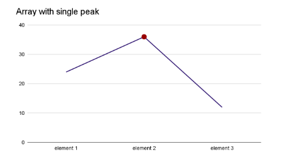
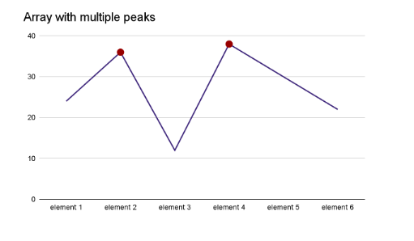
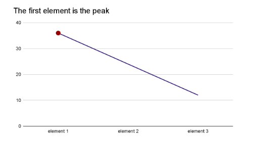
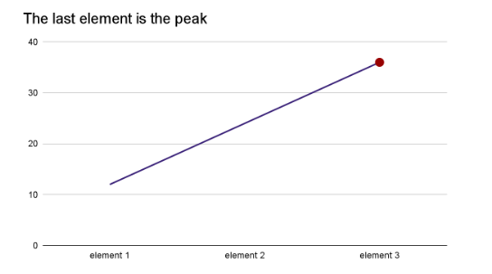

# Find Peak Element 

## Problem Definition
Given an array `nums`, a **peak element** is one that is **strictly greater than its neighbors**.
Return the **index of any peak element**.
> A peak is defined as:  
> `nums[i] > nums[i - 1] && nums[i] > nums[i + 1]`
---

## Binary Search Approach (O(log n))
- Imagine Array with multiple segments sorted in ascending or descending order. If we want to visualize an array with the peak elements from the graphical point of view, it must be one of the following:
## Graph Representation of array





---

### Why Binary Search?
Binary search doesn't always require sorted array.
Even though the array is not sorted, you can use **slope logic** to perform binary search:
- **Case-1**: mid greater than both neighbors → it’s a **peak**
- **Case-2**: mid on an **increasing slope** → "A" peak definitely lies to the **right**
- **Case-3**: mid on a **decreasing slope** → "A" peak definitely lies to the **left**
- **Case-4**: mid in a valley → "A" peak definitely lies on either sides


### Code:
```cpp
class Solution {
public:
    int findPeakElement(vector<int>& nums) {
        int n = nums.size();
        if (n == 1) return 0;
        if (nums[0] > nums[1]) return 0;
        if (nums[n-1] > nums[n-2]) return n-1;

        int low = 1;
        int high = n - 2;

        while (low <= high) {
            int mid = low + (high - low) / 2;

            if (nums[mid] > nums[mid - 1] && nums[mid] > nums[mid + 1]) // Case-1
                return mid; // will always execute
            else if (nums[mid] > nums[mid - 1] && nums[mid] < nums[mid + 1]) // Case-2
                low = mid + 1;
            else // Case-3 & Case-4
                high = mid - 1;
        }

        return -1; // Should never reach here
    }
};
```
---

## Time and Space Complexity

| Approach        | Time Complexity | Space Complexity |
|-----------------|-----------------|------------------|
| Binary Search   | `O(log n)`      | `O(1)`           |
| Linear Search   | `O(n)`          | `O(1)`           |

---

## Why Binary Search is Better Than Linear

| Feature               | Linear Search        | Binary Search         |
|------------------------|----------------------|------------------------|
| Strategy              | Check every element  | Use slope direction    |
| Performance on large input | Slower             | Much faster            |
| Peak Guarantee        | Can find highest peak | Returns *a* peak       |

---

